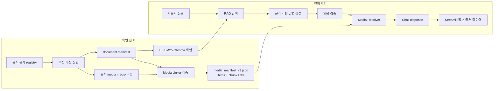

# PiCare 미디어–RAG 통합 파이프라인

## 1. 목적과 적용 범위

이 문서는 현재 PiCare 저장소의 제품 추천, RAG QA, 이미지·영상 자산을 하나의 서비스로
연결하는 기준을 정의한다.

- 제품 추천: sLLM이 사용자 조건을 `ConditionPayload`로 추출하고 catalog가 후보를 선정한다.
- 사용법·문제 해결 챗봇: 공식 문서를 검색하고 근거가 검증된 답변을 생성한다.
- 미디어: 최종 답변이 실제로 인용한 공식 문서 청크와 연결된 이미지·영상만 표시한다.
- A/S: 기술 문제 해결과 보증·수리·리콜을 분리한다. 공식 corpus가 없는 항목은 답변과
  미디어 표시를 모두 보류한다.

제품 사진은 제품 catalog에서, 공식 문서의 RAG용 미디어는 생성된 media manifest에서
관리한다. 기존 `assets/media/*.json`은 팀이 수동 검수한 자산 대장과 호환 linker용으로
유지하지만 런타임 자동 수집 경로와 섞지 않는다.

| 구분 | category | 선택 기준 | 표시 위치 |
|---|---|---|---|
| 제품 사진 | `product` | 추천된 `product_id`·`product_model` | 제품 카드 |
| 사용법 이미지 | `guide` | 답변에 사용된 `citation → chunk_id` | 답변 단계 아래 |
| 사용법 영상 | `guide` | 답변에 사용된 `citation → chunk_id` | 답변 단계 아래 |

## 2. 전체 처리 흐름



핵심 원칙은 **문서 텍스트만 청킹하고 미디어는 청크에 연결하는 것**이다. 이미지 파일,
영상 파일, 영상 URL 자체는 임베딩하거나 청킹하지 않는다.

## 3. 저장소별 역할

### 현재 사용하는 영역

| 경로 | 역할 |
|---|---|
| `document_pipeline/data/source_registry_v3.csv` | RAG에 사용할 공식 문서 목록 |
| `document_pipeline/ingestion/` | 문서 수집·파싱·청킹과 manifest 생성 |
| `document_pipeline/ingestion/build_media_manifest.py` | 공식 원문의 media macro를 검증하고 `media_id`와 청크 연결을 함께 생성 |
| `document_pipeline/data/media_manifest_v3.json` | 생성된 공식 guide 미디어와 `chunk_id ↔ media_id` 링크; Git 제외 |
| `assets/media/manifest.json`, `assets/media/video_manifest.json` | 팀이 수동 검수한 기존 자산 대장; 호환·별도 검증용 |
| `src/media/linker.py` | 기존 수동 자산 대장을 document manifest에 연결하는 호환 linker |
| `src/media/resolver.py` | 최종 citation의 청크에 연결된 생성 media만 선택 |
| `src/rag/` | BM25·Dense·Hybrid 검색과 Chroma 색인 |
| `src/services/rag_qa_service.py` | 사용법·문제 해결 답변과 citation 생성 |
| `src/contracts/models.py` | `ChatCitation`, `MediaItem`, `ChatResponse` 계약 |
| `streamlit_app/app.py` | 최종 답변·출처·미디어 표시 화면 |

### 실제 파일 구조

```text
document_pipeline/
├── ingestion/
│   ├── parse_asciidoc.py           # image/video macro를 텍스트와 분리해 구조 보존
│   ├── build_manifest.py           # 미디어를 제외한 citation-safe 텍스트 청크
│   └── build_media_manifest.py     # media item + 청크 링크 생성·검증
├── contracts/
│   ├── media-manifest.schema.json
│   └── media-manifest-contract.md
└── data/
    └── media_manifest_v3.json      # 실행 시 생성, Git 제외

src/media/
├── __init__.py
├── linker.py                       # 기존 수동 자산 대장의 호환 연결기
└── resolver.py                     # 사용된 citation → 표시할 media 선택

tests/
├── test_media_linker.py             # 수동 대장 호환 경로
└── test_media_pipeline.py           # 자동 추출·연결·resolver 경로
```

## 4. 미디어 수집 계약

### 이미지

자동 수집 경로는 공식 AsciiDoc의 `image::` macro를 읽어 다음 형태로 생성한다. 원문의
상대 URL은 수집 commit에 고정된 `raw.githubusercontent.com/raspberrypi/documentation/...`
URL로 해석하며 허용된 공식 호스트가 아니면 생성에 실패한다.

```json
{
  "media_id": "media-0123456789abcdefabcd",
  "media_type": "image",
  "title": "Raspberry Pi Imager SSH 설정",
  "url": "https://raw.githubusercontent.com/raspberrypi/documentation/<commit>/.../imager-ssh.png",
  "alt_text": "Raspberry Pi Imager에서 SSH를 활성화하는 설정 화면",
  "caption": null,
  "display_mode": "inline",
  "license": "CC BY-SA 4.0",
  "attribution": "Raspberry Pi Ltd",
  "official_verified": true,
  "source_commit": "<40-character commit>",
  "occurrences": [{"document_id": "...", "section": "Install using Imager", "source_anchor": "..."}]
}
```

### 영상

영상은 내려받거나 재배포하지 않는다. 공식 문서 안의 명시적인 `video::ID[youtube]`
macro만 YouTube 링크로 저장한다.

```json
{
  "media_id": "media-abcdef0123456789abcd",
  "media_type": "video",
  "title": "Raspberry Pi Imager로 OS 설치",
  "url": "https://www.youtube.com/watch?v=VIDEO_ID",
  "alt_text": null,
  "caption": null,
  "display_mode": "external_embed",
  "license": "YouTube Terms of Service",
  "attribution": "Raspberry Pi Ltd",
  "official_verified": true,
  "source_commit": "<40-character commit>",
  "occurrences": [{"document_id": "...", "section": "Install using Imager", "source_anchor": "..."}]
}
```

영상에 공식 자막·대본이 있고 사용 권한을 확인한 경우에만 대본을 별도 텍스트 문서로
수집해 시간 구간별로 청킹한다. 영상 URL만으로는 RAG 근거를 만들지 않는다.

## 5. Media Linker

문서 청킹 결과는 변경될 수 있으므로 `chunk_id`를 사람이 입력하지 않는다.
`build_media_manifest.py`가 원문, 수집 ledger, source registry, document manifest를 함께
검증하고 media item과 chunk link를 하나의 manifest에 생성한다. `src/media/linker.py`는
기존 `assets/media/*.json` 수동 대장을 사용하는 경우에만 쓰는 호환 경로다.

### 연결 우선순위

1. 원문 media macro가 속한 `document_id`와 파싱된 `section`을 확정한다.
2. document manifest에서 `document_id + section`이 정확히 같은 승인 청크만 연결한다.
3. 하나의 미디어는 같은 섹션의 여러 청크와 연결할 수 있다.
4. URL, 원문 checksum, registry checksum, 수집 commit이 일치해야 한다.
5. 연결할 청크가 없거나 알 수 없는 미디어가 있으면 임의 연결하지 않고 생성에 실패한다.

### 생성 파일 예시

```json
{
  "schema_version": "1.0.0",
  "document_manifest_checksum": "sha256:...",
  "generated_at": "YYYY-MM-DDTHH:MM:SSZ",
  "items": [{"media_id": "media-...", "media_type": "image", "url": "https://..."}],
  "links": [
    {
      "chunk_id": "rpi-doc-getting-started-install-0003",
      "media_ids": ["media-..."]
    }
  ]
}
```

문서 manifest, source registry 또는 수집 원문이 바뀌면 media manifest를 다시 생성해야 한다.

## 6. 런타임 Media Resolver

`src/media/resolver.py`는 LLM 생성이 끝난 뒤 실행한다. LLM에는 media URL을 생성하거나
선택할 권한을 주지 않는다.

입력:

- 검증을 통과한 `used_citation_ids`
- 최종 `ChatCitation` 목록
- checksum 검증을 통과한 `media_manifest_v3.json`

출력:

- `ChatResponse.media`에 넣을 `MediaItem` 목록

선택 규칙:

1. 최종 답변 본문에 실제 사용된 citation만 처리한다.
2. citation의 `chunk_id`와 연결된 공식 guide 미디어만 QA에 표시한다.
3. 같은 이미지·영상은 한 번만 표시한다.
4. 기본 최대 개수는 이미지 2개, 영상 1개로 제한한다.
5. manifest checksum, URL, 출처·라이선스 검증이 실패하면 서비스 시작 시 해당 manifest를 거부한다.

현재 `MediaItem` 계약은 다음 필드를 사용한다.

```json
{
  "media_id": "media-0123456789abcdefabcd",
  "media_type": "image",
  "title": "Raspberry Pi Imager SSH 설정",
  "url": "https://...",
  "alt_text": "SSH 설정 화면",
  "display_mode": "inline",
  "license": "CC BY-SA 4.0",
  "attribution": "Raspberry Pi Ltd",
  "source_citation_id": "C2"
}
```

Streamlit은 검증된 이미지 URL과 영상의 공식 URL을 사용한다. 향후 저장 위치를 바꾸더라도
`media_id`, 원본 출처, 라이선스는 유지한다.

## 7. 서비스별 통합 위치

### 제품 추천 서비스

`src/services/recommendation_response.py`의 기존 동작을 유지한다.

```text
추천 candidate.image_url
→ ProductRecommendation.image_url
→ 제품 카드 표시
```

제품 사진은 `Media Resolver`의 QA 검색 대상에 넣지 않는다.

### RAG QA 서비스

`src/services/rag_qa_service.py`의 citation 검증 직후에 resolver를 호출한다.

```text
검색 결과
→ LLM 답변 생성
→ validate_grounded_answer()
→ used_citation_ids 확정
→ ChatCitation 생성
→ media_resolver.resolve(final_citations)
→ ChatResponse(media=resolved_media)
```

근거 부족, 확인 질문, 범위 밖, 안전 차단, 오류 응답에서는 `media=[]`를 유지한다.

### Streamlit

Streamlit은 `ChatResponse.media`만 렌더링하고 자체적으로 media를 검색하거나 선택하지 않는다.

```python
for item in response.media:
    if item.media_type == "image":
        st.image(str(item.url), caption=item.title)
    elif item.media_type == "video":
        st.video(str(item.url))
```

각 미디어 아래에는 `source_citation_id`를 표시하고 해당 출처 카드로 이동할 수 있게 한다.

## 8. A/S 처리 기준

현재 corpus에서 가능한 범위:

- 부팅·전원·네트워크·카메라·원격 접속 등의 기술 문제 해결
- LED와 부트로더 진단
- 공식 문서에서 확인되는 점검 순서

별도 공식 문서가 필요한 범위:

- 보증 기간과 적용 조건
- 교환·반품·수리 접수 절차
- 지역·판매처별 지원 정책
- 현재 리콜 여부

후자의 문서를 확보하기 전에는 기존 안전 정책대로 답변과 미디어를 모두 보류한다. 향후
추가할 때는 `published_at`, `updated_at`, `region`, `seller_scope`, `expires_at` metadata를
필수로 둔다.

## 9. 구현·검증 상태

### 완료: 문서·미디어 생성

- 고정된 공식 원문 18개에서 v3 document manifest 270청크를 생성했다.
- media macro는 텍스트 청크에서 제외하고 구조적으로 추출한다.
- 이미지 70개·영상 1개(총 71개, 원문상 occurrence 72개)를 49개 청크에 연결했다.
- JSON Schema, 원문·registry·document manifest checksum, URL allowlist를 검증한다.

생성물은 Git에 커밋하지 않으며 아래 명령으로 함께 재생성한다.

```bash
python -m document_pipeline.ingestion.run_pipeline \
  --source-registry document_pipeline/data/source_registry_v3.csv \
  --raw-root document_pipeline/data/raw_v3 \
  --processed-root document_pipeline/data/processed_v3 \
  --manifest-path document_pipeline/data/manifest_v3.json \
  --media-manifest-path document_pipeline/data/media_manifest_v3.json
```

### 완료: QA·추천 응답 연결

- QA와 추천 서비스 모두 인용 검증 후 실제 사용된 citation만 resolver에 전달한다.
- 보류·범위 밖·오류 응답은 `media=[]`를 유지한다.
- 제품 카드는 catalog의 `ProductRecommendation.image_url`을 유지한다.
- 미디어는 이미지 최대 2개·영상 최대 1개로 중복 제거한다.

### 완료: Streamlit 런타임 연결

- `MEDIA_MANIFEST`가 설정된 경우 런타임이 시작할 때 checksum까지 검증해 resolver를 구성한다.
- `ChatResponse.media`의 이미지·영상과 연결 citation을 표시한다.
- 미디어가 없거나 manifest 설정을 생략해도 텍스트 답변은 독립적으로 동작한다.

### 운영 전 추가 확인

- 외부 이미지·YouTube 링크의 실제 응답 상태와 embed 가능 여부는 배포 환경에서 점검한다.
- 공식 원문 commit 또는 청킹 설정 변경 시 document/media manifest와 Chroma 색인을 함께 재생성한다.
- 실제 LLM 연결 환경에서 답변 → citation → 미디어 표시 시나리오를 최종 확인한다.

## 10. 필수 테스트

| 테스트 | 기대 결과 |
|---|---|
| registry 필수 필드·중복 ID 검증 | 잘못된 항목은 색인 전에 실패 |
| 로컬 이미지 checksum 검증 | 원본 변경·손상 탐지 |
| 문서 URL·섹션 매핑 | 일치하는 청크만 연결 |
| unmatched media 검증 | 임의 연결 없이 사유 기록 |
| citation 연동 | 본문에 사용된 citation의 media만 반환 |
| category 분리 | 제품 사진이 QA 답변에 노출되지 않음 |
| 조건 충돌 | 다른 제품·OS용 media 제외 |
| 중복 제거·상한 | 이미지 2개·영상 1개 이내 |
| 보류 응답 | `media=[]` 유지 |
| 깨진 영상 URL | 답변은 유지하고 영상만 제외 |

## 11. 팀 간 전달 계약

| 담당 영역 | 전달할 결과 |
|---|---|
| 문서·데이터 | 검증된 media manifest, 출처·라이선스·checksum |
| RAG·검색 | document manifest, 안정적인 document/section/chunk ID |
| 챗봇·Streamlit | Media Resolver, `ChatResponse.media` 렌더링 |
| sLLM·추천 | 제품 조건과 product image 연결; QA guide media에는 관여하지 않음 |
| PM·통합 | 지원 범위, A/S 보류 범위, 통합 테스트와 시연 질문 확정 |

한 단계가 완료될 때마다 다음 담당자는 파일 이름이 아니라 `media_id`, `document_id`,
`chunk_id`, `citation_id` 계약으로 연결한다.
