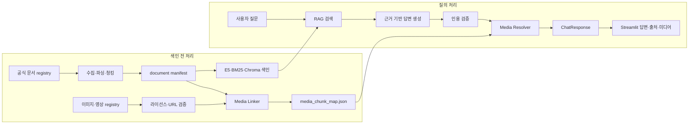

# PiCare 미디어–RAG 통합 파이프라인

## 1. 목적과 적용 범위

이 문서는 현재 PiCare 저장소의 제품 추천, RAG QA, 이미지·영상 자산을 하나의 서비스로
연결하는 기준을 정의한다.

- 제품 추천: sLLM이 사용자 조건을 `ConditionPayload`로 추출하고 catalog가 후보를 선정한다.
- 사용법·문제 해결 챗봇: 공식 문서를 검색하고 근거가 검증된 답변을 생성한다.
- 미디어: 최종 답변이 실제로 인용한 공식 문서 청크와 연결된 이미지·영상만 표시한다.
- A/S: 기술 문제 해결과 보증·수리·리콜을 분리한다. 공식 corpus가 없는 항목은 답변과
  미디어 표시를 모두 보류한다.

제품 사진과 RAG용 미디어는 같은 `assets/media/manifest.json`에서 관리할 수 있지만,
선택 규칙은 분리한다.

| 구분 | category | 선택 기준 | 표시 위치 |
|---|---|---|---|
| 제품 사진 | `product` | 추천된 `product_id`·`product_model` | 제품 카드 |
| 사용법 이미지 | `guide` | 답변에 사용된 `citation → chunk_id` | 답변 단계 아래 |
| 사용법 영상 | `guide` | 답변에 사용된 `citation → chunk_id` | 답변 단계 아래 |

## 2. 전체 처리 흐름



핵심 원칙은 **문서 텍스트만 청킹하고 미디어는 청크에 연결하는 것**이다. 이미지 파일,
영상 파일, 영상 URL 자체는 임베딩하거나 청킹하지 않는다.

## 3. 저장소별 역할

### 기존 파일을 그대로 사용하는 영역

| 경로 | 역할 |
|---|---|
| `document_pipeline/data/source_registry_v3.csv` | RAG에 사용할 공식 문서 목록 |
| `document_pipeline/ingestion/` | 문서 수집·파싱·청킹과 manifest 생성 |
| `assets/media/manifest.json` | 제품 사진 5개와 guide 이미지 14개의 출처·라이선스 대장 |
| `src/rag/` | BM25·Dense·Hybrid 검색과 Chroma 색인 |
| `src/services/rag_qa_service.py` | 사용법·문제 해결 답변과 citation 생성 |
| `src/contracts/models.py` | `ChatCitation`, `MediaItem`, `ChatResponse` 계약 |
| `streamlit_app/app.py` | 최종 답변·출처·미디어 표시 화면 |

### 새로 추가할 영역

```text
assets/media/
├── manifest.json                   # 기존 이미지 + 이후 검증된 영상 metadata
└── images/
    ├── products/                   # 제품 추천용
    └── guides/                     # 사용법·문제 해결용

src/media/
├── __init__.py
├── models.py                       # 내부 registry 모델
├── registry.py                     # registry 로딩·검증
├── linker.py                       # document/section → chunk_id 자동 연결
└── resolver.py                     # 사용된 citation → 표시할 media 선택

data/indexed/
└── media_chunk_map.json            # 실행 시 생성, Git 제외

tests/
├── test_media_registry.py
├── test_media_linker.py
└── test_media_resolver.py
```

## 4. 미디어 수집 계약

### 이미지

기존 `assets/media/manifest.json` 필드는 보존하고 다음 연결 필드를 선택적으로 추가한다.

```json
{
  "media_id": "rpi-guide-0006",
  "media_type": "image",
  "category": "guide",
  "title": "Raspberry Pi Imager SSH 설정",
  "alt_text_ko": "Raspberry Pi Imager에서 SSH를 활성화하는 설정 화면",
  "relative_path": "assets/media/images/guides/imager-ssh.png",
  "source_document_url": "https://www.raspberrypi.com/documentation/computers/getting-started.html",
  "source_section": "Install using Imager",
  "source_asset_url": "https://raw.githubusercontent.com/.../imager-ssh.png",
  "topics": ["os_installation", "ssh", "remote_access"],
  "product_models": [],
  "os_versions": ["current"],
  "license": "CC BY-SA 4.0",
  "attribution": "Raspberry Pi Ltd",
  "modified": false,
  "checksum": "sha256:..."
}
```

### 영상

영상은 내려받거나 재배포하지 않고 공식 URL과 표시 구간만 저장한다.

```json
{
  "media_id": "rpi-video-0001",
  "media_type": "video",
  "category": "guide",
  "title": "Raspberry Pi Imager로 OS 설치",
  "url": "https://www.youtube.com/watch?v=VIDEO_ID",
  "video_id": "VIDEO_ID",
  "start_seconds": 95,
  "end_seconds": 180,
  "channel_name": "Raspberry Pi",
  "official_verified": true,
  "embed_allowed": true,
  "checked_at": "YYYY-MM-DD",
  "source_document_url": "https://www.raspberrypi.com/documentation/computers/getting-started.html",
  "source_section": "Install using Imager",
  "topics": ["os_installation", "imager"]
}
```

영상에 공식 자막·대본이 있고 사용 권한을 확인한 경우에만 대본을 별도 텍스트 문서로
수집해 시간 구간별로 청킹한다. 영상 URL만으로는 RAG 근거를 만들지 않는다.

## 5. Media Linker

문서 청킹 결과는 변경될 수 있으므로 `chunk_ids`를 사람이 원본 registry에 계속 입력하지
않는다. `src/media/linker.py`가 document manifest와 media manifest를 읽어 연결 파일을
자동 생성한다.

### 연결 우선순위

1. `source_document_url`이 같은 문서만 후보로 선택한다.
2. `source_section`이 청크의 section 또는 heading path와 일치해야 한다.
3. `product_models`, `os_versions`가 모두 존재하면 서로 충돌하지 않아야 한다.
4. 하나의 미디어는 같은 섹션의 여러 청크와 연결할 수 있다.
5. 연결할 청크가 없으면 임의 연결하지 않고 검증 실패 목록에 기록한다.

### 생성 파일 예시

```json
{
  "schema_version": "1.0.0",
  "document_manifest_checksum": "sha256:...",
  "media_manifest_checksum": "sha256:...",
  "generated_at": "YYYY-MM-DDTHH:MM:SSZ",
  "links": [
    {
      "media_id": "rpi-guide-0006",
      "chunk_ids": [
        "rpi-doc-getting-started-install-0003",
        "rpi-doc-getting-started-install-0004"
      ]
    }
  ],
  "unmatched_media_ids": []
}
```

문서 manifest 또는 media manifest checksum이 바뀌면 연결 파일을 다시 생성해야 한다.

## 6. 런타임 Media Resolver

`src/media/resolver.py`는 LLM 생성이 끝난 뒤 실행한다. LLM에는 media URL을 생성하거나
선택할 권한을 주지 않는다.

입력:

- 검증을 통과한 `used_citation_ids`
- 최종 `ChatCitation` 목록
- `media_chunk_map.json`
- media manifest
- 질문에서 확정된 제품·OS 조건

출력:

- `ChatResponse.media`에 넣을 `MediaItem` 목록

선택 규칙:

1. 최종 답변 본문에 실제 사용된 citation만 처리한다.
2. citation의 `chunk_id`와 연결된 `category=guide` 미디어만 QA에 표시한다.
3. 제품·OS 조건이 충돌하는 미디어는 제외한다.
4. 같은 이미지·영상은 한 번만 표시한다.
5. 기본 최대 개수는 이미지 2개, 영상 1개로 제한한다.
6. 이미지와 영상이 같은 내용을 설명하면 이미지 1개와 영상 1개만 남긴다.
7. 출처·라이선스·embed 상태가 검증되지 않은 항목은 제외하고 warning을 기록한다.

현재 `MediaItem` 계약은 다음 최소 필드를 지원한다.

```json
{
  "media_type": "image",
  "title": "Raspberry Pi Imager SSH 설정",
  "url": "https://...",
  "source_citation_id": "C2"
}
```

1차 Streamlit에서는 이미지의 `source_asset_url`과 영상의 공식 URL을 사용한다. 다음 달
AWS 전환 후 로컬 이미지는 S3·CloudFront의 HTTPS URL로 교체하되 `media_id`와 원본 출처는
유지한다.

## 7. 서비스별 통합 위치

### 제품 추천 서비스

`src/services/recommendation_response.py`의 기존 동작을 유지한다.

```text
추천 candidate.image_url
→ ProductRecommendation.image_url
→ category=product MediaItem
→ 제품 카드 표시
```

제품 사진은 `Media Resolver`의 QA 검색 대상에 넣지 않는다.

### RAG QA 서비스

`src/services/rag_qa_service.py`의 citation 검증 직후에 resolver를 호출한다.

```text
검색 결과
→ LLM 답변 생성
→ validate_grounded_answer()
→ used_citation_ids 확정
→ ChatCitation 생성
→ media_resolver.resolve(citations, conditions)
→ ChatResponse(media=resolved_media)
```

근거 부족, 확인 질문, 범위 밖, 안전 차단, 오류 응답에서는 `media=[]`를 유지한다.

### Streamlit

Streamlit은 `ChatResponse.media`만 렌더링하고 자체적으로 media를 검색하거나 선택하지 않는다.

```python
for item in response.media:
    if item.media_type == "image":
        st.image(str(item.url), caption=item.title)
    elif item.media_type == "video":
        st.video(str(item.url))
```

각 미디어 아래에는 `source_citation_id`를 표시하고 해당 출처 카드로 이동할 수 있게 한다.

## 8. A/S 처리 기준

현재 corpus에서 가능한 범위:

- 부팅·전원·네트워크·카메라·원격 접속 등의 기술 문제 해결
- LED와 부트로더 진단
- 공식 문서에서 확인되는 점검 순서

별도 공식 문서가 필요한 범위:

- 보증 기간과 적용 조건
- 교환·반품·수리 접수 절차
- 지역·판매처별 지원 정책
- 현재 리콜 여부

후자의 문서를 확보하기 전에는 기존 안전 정책대로 답변과 미디어를 모두 보류한다. 향후
추가할 때는 `published_at`, `updated_at`, `region`, `seller_scope`, `expires_at` metadata를
필수로 둔다.

## 9. 구현 단계

### 1단계: 기존 자산 연결

1. 기존 guide 이미지 14개의 URL·섹션·라이선스를 재검증한다.
2. v3 document manifest를 생성한다.
3. `Media Linker`와 registry 검증 테스트를 구현한다.
4. 모든 guide 이미지의 매핑 결과를 검토한다.

통과 기준: guide 이미지 14개가 적절한 청크에 연결되거나 제외 사유가 기록된다.

### 2단계: QA 응답 연결

1. `Media Resolver`를 구현한다.
2. `RagQaService`에 선택적 resolver 의존성을 추가한다.
3. 실제 사용된 citation과 연결된 미디어만 응답에 포함한다.
4. 근거 부족 응답에서 media가 비어 있는지 테스트한다.

통과 기준: 관련 질문에는 올바른 이미지가 표시되고 무관한 질문에는 표시되지 않는다.

### 3단계: 영상 추가

1. 공식 영상 3~5개의 URL·채널·embed 상태·시작 시간을 기록한다.
2. 영상도 같은 linker와 resolver를 사용한다.
3. 영상이 삭제·비공개일 때 공식 문서 링크만 남도록 fallback을 구현한다.

통과 기준: 영상 실패가 전체 챗봇 답변 실패로 이어지지 않는다.

### 4단계: Streamlit 실연동

1. mock service를 실제 `RagQaService`로 교체한다.
2. `ChatResponse`의 answer, citations, media를 그대로 표시한다.
3. 제품 추천 화면은 기존 product 이미지 경로를 유지한다.

통과 기준: 질문 → 답변 → citation → 이미지·영상까지 한 화면에서 확인할 수 있다.

## 10. 필수 테스트

| 테스트 | 기대 결과 |
|---|---|
| registry 필수 필드·중복 ID 검증 | 잘못된 항목은 색인 전에 실패 |
| 로컬 이미지 checksum 검증 | 원본 변경·손상 탐지 |
| 문서 URL·섹션 매핑 | 일치하는 청크만 연결 |
| unmatched media 검증 | 임의 연결 없이 사유 기록 |
| citation 연동 | 본문에 사용된 citation의 media만 반환 |
| category 분리 | 제품 사진이 QA 답변에 노출되지 않음 |
| 조건 충돌 | 다른 제품·OS용 media 제외 |
| 중복 제거·상한 | 이미지 2개·영상 1개 이내 |
| 보류 응답 | `media=[]` 유지 |
| 깨진 영상 URL | 답변은 유지하고 영상만 제외 |

## 11. 팀 간 전달 계약

| 담당 영역 | 전달할 결과 |
|---|---|
| 문서·데이터 | 검증된 media manifest, 출처·라이선스·checksum |
| RAG·검색 | document manifest, 안정적인 document/section/chunk ID |
| 챗봇·Streamlit | Media Resolver, `ChatResponse.media` 렌더링 |
| sLLM·추천 | 제품 조건과 product image 연결; QA guide media에는 관여하지 않음 |
| PM·통합 | 지원 범위, A/S 보류 범위, 통합 테스트와 시연 질문 확정 |

한 단계가 완료될 때마다 다음 담당자는 파일 이름이 아니라 `media_id`, `document_id`,
`chunk_id`, `citation_id` 계약으로 연결한다.
